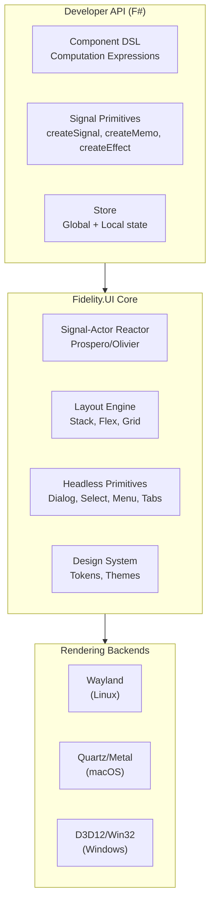

# Fidelity.UI

[](LICENSE)
[](Commercial.md)
[]()

> **Note:** This project is currently in the preliminary design phase. The documentation describes the intended architecture and features. Implementation has not yet begun.

**Native UI for the Fidelity Framework - Signal-Reactive, Actor-Driven, Zero Compromise**

Fidelity.UI is the native user interface library for the Fidelity ecosystem. It provides the developer ergonomics of modern web UI frameworks (SolidJS, DaisyUI, TanStack) with pure native performance compiled through Firefly.

The core insight: **signals and actors are the same abstraction**. A signal that notifies its subscribers when it changes is an actor that sends messages to its dependents. Fidelity.UI unifies these models, building reactive UI on top of the Prospero/Olivier actor infrastructure rather than inventing a separate reactivity runtime.

## Why Fidelity.UI?

### The Web Got Ergonomics Right

Modern web UI development has converged on powerful patterns:
- **Fine-grained reactivity** (SolidJS signals) - only touched nodes update
- **Headless components** (Kobalte/Radix) - behavior without visual opinion
- **Semantic design systems** (DaisyUI/Tailwind) - design tokens, not inline styles
- **Type-safe data management** (TanStack) - queries, mutations, caching

These patterns deserve native performance. Fidelity.UI brings them to compiled F# without a browser, without a virtual DOM, and without a JavaScript runtime.

### The Native World Got Performance Right

Native UI means:
- Direct compositor access (Wayland, Quartz, Win32)
- GPU-accelerated rendering without browser overhead
- Microsecond event dispatch, not millisecond
- Memory measured in kilobytes per component, not megabytes
- Startup in milliseconds, not seconds

### Fidelity.UI Gets Both

```
Developer ergonomics of SolidJS + DaisyUI + Kobalte + TanStack
                            +
Native performance of Wayland/Quartz/D3D12 via Firefly compilation
                            +
Actor-model reactivity via Prospero/Olivier
```

## Architecture



### The Signal-Actor Model

Fidelity.UI does not use a virtual DOM. There is no tree diffing. Instead:

1. **Signals** are reactive values that track their subscribers
2. **Components** are functions that run once, creating signal subscriptions
3. **Layout regions** subscribe to signals that affect their geometry
4. **Render regions** subscribe to signals that affect their pixels
5. When a signal changes, only subscribed regions recalculate and repaint

This is architecturally identical to the actor model:
- A signal change is a message
- A subscriber is an actor with a mailbox
- The dependency graph is the message routing topology
- Batching is mailbox coalescing

Prospero/Olivier provides the reactive substrate. Fidelity.UI builds UI semantics on top.

### Relationship to WRENStack

WRENStack (WebView + Reactive + Embedded + Native) is a SpeakEZ **product** that uses a system WebView for rendering. Fidelity.UI is the **framework** for building native UI without a WebView.

The two are complementary:

| Aspect | WRENStack | Fidelity.UI |
|--------|-----------|-------------|
| Rendering | System WebView (WebKitGTK, WKWebView, WebView2) | Direct compositor (Wayland, Quartz, Win32) |
| UI Language | HTML/CSS via Partas.Solid | F# DSL compiled to native |
| Reactivity | SolidJS runtime (JavaScript) | Signal-Actor model (compiled F#) |
| Styling | DaisyUI + Tailwind (CSS) | Design token system (native) |
| Maturity | Usable today | Design phase |

Critically, the **developer-facing API is designed to feel familiar** to developers who have built WRENStack applications. The signal primitives, component composition patterns, and store model share conceptual DNA with Partas.Solid and TanStack Store.

WRENStack applications can progressively migrate to Fidelity.UI as the native rendering backends mature. See [docs/05_wren_migration.md](docs/05_wren_migration.md).

## Design Principles

### 1. Signals Are Actors

The reactive model is not bolted on top of an imperative rendering loop. It *is* the rendering loop. Every signal change flows through the Prospero/Olivier actor graph to exactly the layout and render regions that depend on it. No broadcast, no diffing, no polling.

### 2. Study, Don't Adopt

Fidelity.UI is informed by deep study of Fabulous (F# MVU), ReactiveElmish.Avalonia (Elmish + MVVM bridge), SolidJS (fine-grained reactivity), Kobalte (headless components), and DaisyUI (semantic design tokens). It adopts their **API conventions** without inheriting their **infrastructure assumptions** (virtual DOM, browser rendering, .NET runtime).

### 3. Headless First

UI behavior (focus management, keyboard navigation, ARIA semantics, state machines) is separated from visual presentation. A `Dialog` component manages open/close state, focus trapping, and escape-key handling. How it *looks* is a separate concern defined by the design system.

### 4. Platform Through Fidelity.Platform

Rendering backends are defined in Fidelity.Platform, not hard-coded in Fidelity.UI. The same component tree renders to Wayland on Linux, Quartz on macOS, and Win32 on Windows. Platform-specific capabilities (GPU acceleration, compositor effects) are accessed through the platform abstraction, not conditional compilation in UI code.

### 5. Developer Ergonomics Are Non-Negotiable

If the API requires more ceremony than the web equivalent, it's wrong. F# computation expressions, phantom type safety, and FNCS intrinsics should make the developer experience *better* than web, not worse. A developer who knows SolidJS + DaisyUI should feel at home immediately.

## Technology Stack

### Core (F# Native via Firefly)
- **Signal-Actor Reactor**: Built on Prospero/Olivier actor infrastructure
- **Layout Engine**: Stack, Flex, Grid primitives with constraint solving
- **Component Model**: Computation expression DSL with phantom type markers
- **Design System**: Hierarchical tokens, theme switching, semantic classes

### Platform Rendering
- **Linux**: Wayland compositor protocol via libwayland-client
- **macOS**: Quartz/Core Graphics, Metal for GPU acceleration
- **Windows**: D3D12 for GPU rendering, Win32 for windowing

### Dependencies
- **Fidelity.Platform**: OS abstraction (memory, display, input, events)
- **FNCS**: Intrinsic type definitions, platform binding resolution
- **Firefly**: AOT compilation to native binary

## Documentation

See the [docs/](./docs/) folder for detailed documentation:

- [00_architecture.md](./docs/00_architecture.md): Signal-Actor reactive architecture
- [01_signal_system.md](./docs/01_signal_system.md): Fine-grained reactivity primitives
- [02_component_model.md](./docs/02_component_model.md): Composition DSL and phantom types
- [03_rendering_backends.md](./docs/03_rendering_backends.md): Platform rendering (Wayland, Quartz, D3D12)
- [04_design_system.md](./docs/04_design_system.md): Tokens, themes, headless primitives
- [05_wren_migration.md](./docs/05_wren_migration.md): WRENStack to native migration path

## Related Projects

| Project | Role |
|---------|------|
| [Firefly](https://github.com/speakeztechnologies/Firefly) | F# Native AOT compiler |
| [Fidelity.Platform](https://github.com/speakeztechnologies/Fidelity.Platform) | OS abstraction layer |
| [FNCS](https://github.com/speakeztechnologies/fsnative) | F# Native Compiler Services |
| [Partas.Solid](https://github.com/Partas/Partas.Solid) | F# SolidJS bindings (WRENStack frontend) |
| [WRENStack.Tooling](https://github.com/speakeztechnologies/WRENStack.Tooling) | WRENStack design-time tooling |
| [Atelier](https://github.com/speakeztechnologies/Atelier) | Fidelity IDE (WRENStack, future Fidelity.UI) |
| [Fabulous](https://github.com/fabulous-dev/Fabulous) | F# MVU framework (reference, not dependency) |
| [ReactiveElmish.Avalonia](https://github.com/JordanMarr/ReactiveElmish.Avalonia) | Elmish + reactive stores (reference) |

## The Name

Fidelity.UI reflects the core promise: **fidelity** to the developer's intent. The component you describe in F# is the component that renders on screen - no intermediate virtual representation, no runtime interpretation, no framework tax between your code and the pixels.

## License

Dual-licensed under Apache 2.0 and a commercial license. See [LICENSE](LICENSE) and [Commercial.md](Commercial.md) for details.
