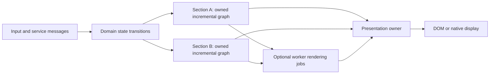

# Fidelity.UI architectural reconsideration

Research review, 18 September 2026. This is a proposal for discussion, not an adopted API or an implementation claim. Fable.Ripple and the other F# libraries are research references. No library adoption or implementation changes are part of this review. Code examples below are proposed Clef-shaped notation unless explicitly identified as existing source.

During the review, the user endorsed the emerging direction, emphasized a new native reactive-area engine, and requested alignment of the standing drafts, site documentation and blog material. Those documentation changes are included. Descriptions of superseded claims below refer to the starting snapshots; linked current documents may now contain their corrections. No compiler/runtime behavior was changed or newly validated by these edits.

The subsequent clarification establishes a foundational constraint: Fidelity intentionally starts from cold, demand-driven incremental computation. The framework author identifies Jimmy Byrd's ColdTasks as a major influence on adopting `Incremental<'T>` and connects that policy to Fidelity's Braid of delimited continuations and interaction nets. The UI direction below preserves that commitment. Maxime Mangel's additional explanation of Ripple.Form.Plain informs the separation of reusable behavior from replaceable presentation.

The default must also permit deliberately earlier or continuous demand. The author gives the example of keeping a time-series read current in the background so that switching views is fast. Controlled hardware and unikernel deployments motivate budgeting that tradeoff explicitly: less idle work can mean more first-request work, while a selected warm working set spends background resources to reduce that latency. Surface visibility does not define all application demand.

**The recommendation is to make quiet functional composition the default, with one semantic model beneath optional computation-expression surfaces.** That model should combine owned incremental graphs, stable component identities, typed reactive bindings, semantic controls, and explicit boundaries between execution domains. Concurrent sections need ownership and scheduling contracts; they do not require braces or `let!`. CEs can make resource scopes and dependent computations easier to express, but they should earn their place through concrete ergonomic benefits.

**The primary native direction is a new Clef-native reactive-area engine.** This incorporates the user's clarification during the review: both existing native and WREN UI work are experimental, and neither has an architectural veto. LVGL is a reference for embedded UI scope and constraints, not a selected engine or an assumed internal design. The native-area model needs to be designed and measured in its own right.

The larger change is to make Fidelity.UI the portable semantic UI layer for both WREN and that native engine. WREN becomes a DOM/WebView realization of the shared contract, alongside native desktop/mobile and constrained embedded realizations. Platform-specific HTML, native integration, graphics and device features remain available through explicit capabilities. The portable API shares behavior and composition; it does not promise that arbitrary HTML/CSS becomes native UI or that every device implements every control.

This moves the architectural line farther than adding a second DSL to the current proposal. It preserves Fabulous's contribution to typed composition, Solid's fine-grained updates, Elmish's explicit state transitions, and Clef's compiler-visible semantics without making any of those projects the definition of Fidelity.UI.

| Decision | Recommendation | Reason to reconsider later |
|---|---|---|
| Default view syntax | Functions, lists and modifiers | Measured authoring problems that a CE solves substantially better |
| Activation and demand | Cold UI descriptions; owned activation; demand-driven incremental derivations | Tune specialization and scheduling while preserving the observable activation contract |
| Readiness policy | On demand by default; explicit retained caches, background observation and scoped preparation | Measured first-use/switch latency, freshness, memory and background execution budgets |
| CE support | Optional elaboration of the same semantic operations | A use case requiring a separate contract should get a separately named workflow builder |
| Reactive semantics | Clef `Signal` / `Memo` / `Effect` over `Incremental` / `Observable` | Change only after semantic conformance evidence, not to match another library's spelling |
| Actor granularity | Execution domains, services and substantial sections | Demonstrated benefit from finer granularity without breaking consistency or budgets |
| State model | Local signals plus optional pure reducers and selective projections | Domain-specific consistency requirements |
| Portable UI vocabulary | Semantic controls/layout, with capability extensions | A target cannot preserve a control's promised behavior |
| Default presentation | Replaceable control kit over typed field/control behavior | A control needs a different behavioral contract, not just different appearance |
| Initial browser investigation | Compare a bounded Solid adapter with direct DOM realization of the area contract | Select on semantic fit and measured engineering cost; existing packaging is useful evidence |
| Primary native realization | A new reactive-area engine for incremental layout, paint and composition | Adjust internal update granularity from evidence, preserving the area ownership contract |
| Embedded realization | A restricted, budgeted profile of the same semantics | Actual board measurements, not desktop extrapolation |

**The repository evidence describes several generations of architecture.** It is important to read them together without treating them as equally current or equally implemented.

| Evidence | What it establishes | What it does not establish |
|---|---|---|
| This repository's older design documents | An intended CE API, signals, headless behavior, native rendering and an Elmish adapter | A working generic UI runtime or parity between targets |
| This repository's current source | Descriptor constructors/modifiers and a small rendering bridge | A retained child tree, generic layout, reactive mounting or native text controls |
| Current Clef reactive/incremental specifications | A normative direction for closure callbacks, stabilization, compiler-visible dependencies and native/JS parity | That all specified lowering, lifetime checks or UI semantics are implemented |
| WrenHello | An experimental Solid/Fable frontend, native Composer host, embedded assets and message bridge | Clef-to-JSX, transparent distributed signals, or a general multiwindow runtime |
| HelloWayland | An experimental native presentation path and bounded parallel rendering evidence | A complete Fidelity.UI implementation or arbitrary parallel mutation of UI state |
| MCU documentation | A concrete board execution foundation and a wider architecture | A validated LVGL-scale native Clef UI engine |

Before this review, the README labelled implementation as not begun, although source already existed. That source is nevertheless a small scaffold: `Widget` has `ChildCount` but no child references; `vstack` and `hstack` record the array length and discard the array. The current renderer draws an SVG path, logs labels and boxes, and reports other kinds as unimplemented. The pre-existing working-tree splash changes add composition work, not the missing generic UI system. These limitations explain why this is an appropriate point for reconsideration. They do not invalidate the platform work. See [widget types](/home/hhh/repos/Fidelity.UI/src/Types.clef:24), [container constructors](/home/hhh/repos/Fidelity.UI/src/Widgets.clef:65), and [render dispatch](/home/hhh/repos/Fidelity.UI/src/Render.clef:102).

The June reactive specification, clarified during this review, is a more useful foundation than the February UI architecture. Signals are a surface over Observable and Incremental intrinsics; reactive callbacks are closures; effects have actor/region lifetimes; native and JavaScript are peer target pathways. Its compiler-visible reactive plan supersedes the old mandatory global signal-table design. Fidelity.UI should not silently install Ripple's runtime as a competing native reactive substrate. Study the semantics and tests; implement through the Clef contract. See [Reactive Signals](/home/hhh/repos/clef-lang-spec/spec/reactive-signals.md:14).

Composer's September 15 frontend review is unusually clear about implementation status. WrenHello currently follows F# / Partas.Solid → Fable → JSX → Solid/Vite → embedded HTML → WebView. The additional Clef → portable middle end → JavaScript/JSX realization is proposed. Partas's Fable plugin is not a Clef lowering rule, and merely adding TypeScript bindings does not supply that rule. The Observable and Incremental foundation PRDs also remain labelled planned. See [frontend toolchain review](/home/hhh/repos/Composer/docs/javascript-targeting/10_jsx_and_webview_toolchain.md:3), [Observable foundations](/home/hhh/repos/Composer/docs/PRDs/R-01-ObservableFoundations.md:3), and [Incremental foundations](/home/hhh/repos/Composer/docs/PRDs/R-04-IncrementalFoundations.md:3).

WrenHello is especially instructive because its actual state flow is smaller and clearer than the larger framework claims: the native backend owns the counter, the frontend sends commands, and returned events update a local Solid signal. Theme state is frontend-local. The current transport uses bounded ASCII WebKit script messages; BAREWire/WebSocket is the target architecture, not the implemented bridge. The single-window protocol lacks the revision/snapshot/resume machinery a distributed or multiwindow application would require. Its native UI gate covers real button-to-native-to-DOM behavior and malformed/lifecycle messages, but this review did not rerun it. See [frontend state](/home/hhh/repos/WrenHello/src/Frontend/App.fs:16), [native state](/home/hhh/repos/WrenHello/src/Backend/Main.fs:8), [transport status](/home/hhh/repos/WrenHello/README.md:96), and [gate scope](/home/hhh/repos/WrenHello/tests/native-ui/README.md:5).

Current HelloWayland bypasses this Fidelity.UI scaffold. Its default manifest selects typed CPU host/window/rendering sources and Ariel. Workers fill disjoint borrowed pixel ranges, return synchronously, and the owner presents after they retire. Frame callbacks and compositor buffer release are explicitly different lifetimes. Ariel currently provides one process-wide synchronous work region; competing/nested submissions return Busy, and the host does not yet return asynchronously to event dispatch during rendering. This is valuable evidence for native memory and presentation contracts, not an existing independent-area scheduler. See [active manifest](/home/hhh/repos/HelloWayland/HelloWayland.fidproj:17), [scoped work](/home/hhh/repos/HelloWayland/src/Cpu/Typed/MappedFill.clef:29), [buffer availability](/home/hhh/repos/HelloWayland/src/Cpu/Window.clef:187), [Ariel admission](/home/hhh/repos/Fidelity.Platform/Environments/Linux/x86_64/Ariel/Region.clef:252), and [async limitation](/home/hhh/repos/HelloWayland/docs/multi-core-cpu.md:203).

The site corpus also contains competing generations of intent. The early Fabulous/LVGL article explicitly envisaged reusing LVGL layout; a new Clef-native engine is a larger, different direction. The window-layout article already used quiet function/list composition with process-related metadata, so syntax coherence has historical support. Its process/affinity claims and virtual-tree sketch should nevertheless remain historical. More recent JS/JSX material separates workload, subscription and view lifetimes. MCU documentation records actual HelloBlinky board acceptance, while actor integration and a graphical UI remain separate work. See [historical LVGL plan](/home/hhh/repos/clef-lang-site/hugo/content/blog/leveraging-fabulous-for-native-ui.md), [functional window layout](/home/hhh/repos/clef-lang-site/hugo/content/blog/window-layout-with-fidelity.md), [current frontend design](/home/hhh/repos/clef-lang-site/hugo/content/docs/design/javascript-targeting/javascript-jsx-toolchain.md), and [MCU status](/home/hhh/repos/clef-lang-site/hugo/content/docs/internals/hardware/fidelity-on-mcu.md).

**There are four independent choices hiding inside the perceived DOM-versus-CE split.** They are how views are written, how changing values are observed, what owns mounted state, and where work executes. A function API can construct a compiled graph. A CE can eagerly build ordinary objects. Either can describe local, asynchronous or distributed work if its semantic operations support those things. Neither guarantees concurrency safety by syntax alone.

Ripple provides a particularly useful counterexample to the split: it has the quiet DOM API and a separate `signal` CE. The latter maps `Bind` to `Signal.bind`, `BindReturn` to `map`, and `MergeSources` to `map2`. That is a distinction between dependent and applicative reactive computation, not between single-thread and multi-thread views. See [Ripple's builder](/home/hhh/repos/Fable.Ripple/src/Fable.Ripple/Builder.fs:3).

Likewise, two nested UI sections do not become safely independent because they are written as two computation expressions. They may still share a mutable model, a parent layout constraint, a focus chain, a graphics context or the same native event loop. Conversely, `Ui.section policy factory` can carry exactly the same ownership and scheduling information as a `section { ... }` block.

**The F# libraries contribute different lessons; none defines the native update unit.** Their value is clearer when syntax and execution are compared separately.

| Reference | Useful contribution | What Fidelity should reconsider |
|---|---|---|
| Fable.Ripple | Quiet direct bindings; explicit structural switching; map/bind and optional signal CE; keyed row scopes | Eager live-DOM construction, ambient global scheduler/owner state, and browser lifetime assumptions |
| Fable.Ripple.Form / Plain | Typed field behavior, validation and owned lists beneath replaceable presentation | DOM-specific render callbacks and browser facilities; local reference-based list identity |
| Jimmy Byrd's ColdTasks / IcedTasks | Cold descriptions with explicit activation; acknowledged influence on Fidelity's default posture | Deferred start alone does not provide memoization, dependency tracking or invalidation |
| Partas.Solid | Typed authoring facade and concrete compiler transformation fixtures | Its Fable-specific transformation and Solid semantics do not automatically become a native engine |
| Fabulous | Typed composition, local components, reducers, subscriptions and renderer separation | Component re-evaluation/diffing and positional state/collection assumptions need not define area updates |
| ReactiveElmish.Avalonia | Pure state transitions feeding selective bindings into retained views | Avalonia/.NET implementation machinery and dispatcher are target-specific |
| FSharp.Data.Adaptive | Demand-driven values, dynamic graph dependencies and collection deltas; CE and combinators | GC/weak-reference lifetime mechanisms and .NET locking are not a native MCU prescription |

Ripple is an especially useful study of structure versus content. `Html.switch` selects structure from an explicit source, while nested bindings update content; a broader dynamic rebuild can reset unrelated input state. Its DOM constructors immediately allocate/mutate DOM nodes, and `Html.mount` appends an already-created item and returns `unit`. Fidelity should preserve the quiet expression style while using deferred owned mounting with an unmount lifetime. A signal object handed to `Html.output` supplies a binding; an eagerly computed plain value cannot. See [DOM construction](/home/hhh/repos/Fable.Ripple/src/Fable.Ripple.Dom/Base.fs:56), [control flow](/home/hhh/repos/Fable.Ripple/docs/content/ripple-dom/control-flow.md:79), and [mount](/home/hhh/repos/Fable.Ripple/src/Fable.Ripple.Dom/Html.fs:468).

Ripple's retained keyed rows expose another useful distinction: preserving a row by key does not itself replace the immutable item captured when that row was created. A portable keyed control needs both stable identity and a current payload binding/update contract. ReactiveElmish's keyed binding explicitly supports updating retained mapped items and disposing removed ones. Test reorder and same-key/new-payload cases separately. See [Ripple row creation](/home/hhh/repos/Fable.Ripple/src/Fable.Ripple.Dom/Dom.fs:118) and [ReactiveElmish keyed binding](https://github.com/JordanMarr/ReactiveElmish.Avalonia/blob/598a6f7a63d0dca85c6fa4e1ed207d9fe0e59a6c/src/ReactiveElmish/ReactiveElmishViewModel.fs#L164).

**Ripple.Form sharpens the separation between behavior and presentation.** Maxime describes Plain as a starting point that applications can outgrow: adjust styling tokens, shadow a field constructor with a replacement renderer, or supply a different renderer and list markup. The inspected source supports that layering. `Base.field` supplies parsing, required checks, dirty/reset/commit and contextual validation; a Plain field constructor passes it a rendering function. Replacing the function can retain those behaviors. See [field construction](/home/hhh/repos/Fable.Ripple/src/Fable.Ripple.Form/Base.fs:121), [Plain constructors](/home/hhh/repos/Fable.Ripple/src/Fable.Ripple.Form.Plain/Form.fs:76) and the peer checkout's [custom-view guide](/home/hhh/repos/Fable.Ripple/docs/content/ripple-form/custom-view.md).

Its form core is still browser-specific: `RenderContext.RenderItems` and the `Item` cases return `DomItem`; dependent branches use DOM construction; asynchronous validation uses browser timers and promises. “No default presentation” therefore does not establish a native renderer contract. Fidelity should carry the separation through to typed semantic controls and owned effects that either backend can realize. That is research transfer, not a proposal to adopt Ripple.Form. See [render boundary](/home/hhh/repos/Fable.Ripple/src/Fable.Ripple.Form/Types.fs:156), [dynamic content](/home/hhh/repos/Fable.Ripple/src/Fable.Ripple.Form/Base.fs:405), and [validation](/home/hhh/repos/Fable.Ripple/src/Fable.Ripple.Form/Base.fs:257).

`Form.listWith` is especially relevant to native areas. Its shared machinery creates a form in an owned root for each item, preserves reactive positions, aggregates results and disposes removed entries while letting the caller replace list presentation. But its cache uses JavaScript item identity, not a caller-selected domain key. Refreshed immutable records or deserialized snapshots need a different identity contract. Fidelity should retain logical keys, separately current payloads and explicit duplicate/remove/reinsert policies. See [list ownership](/home/hhh/repos/Fable.Ripple/src/Fable.Ripple.Form.Plain/Fields/FormList.fs:65). Its validation generation checks reject obsolete completions; they do not cancel already-issued work. Native completion additionally needs owner-affine publication and valid scope/input revisions.

The resulting Fidelity control kit should be replaceable while preserving the mounted field's raw editing state, validation and logical identity. A pure area redraw must not recreate that controller. A form-list renderer and a native/DOM backend are two different replacement boundaries. Custom presentation must still bind labels, errors, disabled/read-only state and focus behavior correctly. A designer can use custom presentation for selection handles, but opaque render callbacks do not supply inspectable properties, persistent design identities or undoable edit commands. Keep optional design metadata separate from the small-device runtime contract. The [aligned design-system draft](04_design_system.md) develops these obligations.

Partas's builder facade is transformed by a Fable declaration plugin into JSX; Solid bindings import the actual reactive machinery. That distinction is the central compiler lesson. Fabulous also explicitly schedules component rendering through its tree context, demonstrating that CE notation does not own thread policy. Its local MVU support means it should not be caricatured as requiring one global model. See [Partas builder](/home/hhh/repos/Partas.Solid/Partas.Solid/Builder.fs:119), [compiler plugin](/home/hhh/repos/Partas.Solid/Partas.Solid.FablePlugin/Plugin.fs:1080), [Fabulous rendering](/home/hhh/repos/Fabulous/src/Fabulous/Components/Component.fs:157), and [local MVU](/home/hhh/repos/Fabulous/src/Fabulous/Components/Mvu.fs:21).

ReactiveElmish selectively filters property projections and explicitly dispatches through the UI thread. It is concrete evidence that pure reducer state and selective visual updates can coexist. Adaptive adds an important scalability lesson: incremental collections carry changes as deltas; a scalar signal containing a large replacement array is not automatically an efficient incremental collection. Its `transact` concerns invalidation/commit, not proof of database rollback or isolation. See [selective bindings](https://github.com/JordanMarr/ReactiveElmish.Avalonia/blob/598a6f7a63d0dca85c6fa4e1ed207d9fe0e59a6c/src/ReactiveElmish/ReactiveElmishViewModel.fs#L35), [UI dispatch](https://github.com/JordanMarr/ReactiveElmish.Avalonia/blob/598a6f7a63d0dca85c6fa4e1ed207d9fe0e59a6c/src/ReactiveElmish.Avalonia/AvaloniaStore.fs#L19), and [Adaptive's introduction](https://fsprojects.github.io/FSharp.Data.Adaptive/).

None of these references establishes that allocating a reactive node for every native property is optimal. Compare leaf bindings, pure area recomputation and a hybrid. Leaf tracking avoids repeated computation but consumes graph/edge storage and scheduling work; area recomputation may repeat cheap calculations while simplifying ownership, scratch storage and display-list generation. The primary native experiment should determine that balance.

**Jimmy Byrd has directly relevant public prior art, including an implementation actually called `viewCE`.** On 15 February 2023, TheAngryByrd posted a WebSharper builder supporting reactive values, variables, async computations and promises, including applicative combinations. He also recorded incomplete testing and large-loop problems. This establishes authorship of that proposal, not its adoption upstream or invention of view CEs generally. It does not uniquely identify what he meant in the user-provided chat. See [Jimmy's Updated ViewCE](https://github.com/dotnet-websharper/ui/issues/263).

The terminology matters: WebSharper's `View<'T>` is a read-only changing value. It is not an HTML/layout element. Its `ConstAsync` operation becomes constant after the asynchronous result arrives. Thus this particular `viewCE` belongs with Ripple's `signal` CE and Clef's incremental computations, rather than establishing a reason to make visual layout use a CE. See [WebSharper's View contract](https://github.com/dotnet-websharper/ui/blob/b9e0acdcbbd15ba37aebdf2dbad0449357efc90a/WebSharper.UI/Reactive.fsi#L31).

Jimmy's [TypeSafeViewEngine](https://github.com/TheAngryByrd/TypeSafeViewEngine) contributes another idea: typed field paths for form generation/model binding, avoiding drift between domain fields and HTML names. Its [implementation](https://github.com/TheAngryByrd/TypeSafeViewEngine/blob/a63337b2d20af911a0ec41a7d6b445110cf506c2/src/TypeSafeViewEngine/Library.fs#L115) uses quotations and TypeShape/Giraffe. That is relevant to Fidelity's typed field/selector design; it is not evidence of a generic native visual CE.

[AdaptiveSlop](https://github.com/TheAngryByrd/AdaptiveSlop), a collaborative experimental repository under Jimmy's account, is also useful. It describes itself as AI-assisted; the history includes Jimmy's initial/TUI work and substantial later core work by Angel Munoz. Its pull-oriented core and functional terminal views provide additional research material, not a validated native-area engine. See [the contribution history](https://github.com/TheAngryByrd/AdaptiveSlop/commits/master/).

Its core makes ownership concrete: a graph belongs to its creating thread, foreign producers post updates, and transactions defer writes until commit. Reads during that transaction therefore differ from an immediate-write/deferred-effect batch. Fidelity must choose and test its own semantics. See [graph ownership](https://github.com/TheAngryByrd/AdaptiveSlop/blob/4c0402caa05b394c9ae2ce3cb8c2d5f8daef4f2c/src/AdaptiveSlop.Core/Library.fs#L275) and [transactions](https://github.com/TheAngryByrd/AdaptiveSlop/blob/4c0402caa05b394c9ae2ce3cb8c2d5f8daef4f2c/src/AdaptiveSlop.Core/Library.fs#L524).

There is a relevant integration warning in the inspected source: the TUI's timer callbacks directly access adaptive state, while the newer core requires owner-thread access and checks it in debug builds. The callbacks swallow exceptions. This source-level mismatch was not executed here; it means the TUI should not be cited as proven concurrent UI. Its rendering also compares terminal output, rather than implementing independent native paint areas. See [TUI rendering and run loop](https://github.com/TheAngryByrd/AdaptiveSlop/blob/4c0402caa05b394c9ae2ce3cb8c2d5f8daef4f2c/src/AdaptiveSlop.Tui/Library.fs#L1716).

The useful inference is a three-way separation: visual construction, reactive computation, and area/resource workflow. Keep the visual experiment functional, express the same derived area model once with combinators and once with a CE, and compare the resulting dependency plan and lifetime behavior. Introduce a visual CE as a separate experiment. `Source` adaptation and applicative combination can improve ergonomics without promising concurrency. A `use` clause must identify whether it owns construction-time work or a mounted resource; those lifetimes are different.

**Cold construction and incremental demand are the starting contract.** Jimmy's [IcedTasks documentation](https://github.com/TheAngryByrd/IcedTasks#coldtask) describes `ColdTask<'T>` as `unit -> Task<'T>`: the description starts on invocation and can be invoked again. That is the relevant influence the framework author identifies. Deferred activation, result caching, invalidation and scheduling remain distinct mechanisms; the [builder comparison](https://www.jimmybyrd.me/IcedTasks/Explanations/Choosing-a-builder.html) also separates activation from scheduling and cancellation. Composer's older [parallel-nanopass proposal](/home/hhh/repos/Composer/docs/Parallel_Nanopass_Architecture.md:103) records IcedTasks intent, not proof of its use in today's compiler implementation.

Clef's existing specification already distinguishes `Cold<'T>` without a cache, `Lazy<'T>` with a once-computed cache, and `Incremental<'T>` with dependency-tracked invalidation and cutoff. A stale incremental node without downstream observation does not participate in stabilization. `Cold<Incremental<'T>>` additionally postpones constructing the graph and registering its dependencies. These are complementary ways to avoid premature work, and the UI facade should make their composition natural. See [evaluation strategies](/home/hhh/repos/clef-lang-spec/spec/incremental-computation.md:18), [demand](/home/hhh/repos/clef-lang-spec/spec/incremental-computation.md:279) and [deferred graph construction](/home/hhh/repos/clef-lang-spec/spec/incremental-computation.md:519).

The proposed UI lifecycle is therefore:

```text
cold description → admit an owner and logical instance
                 → background, preparation or presentation demand
                 → stabilize demanded stale work
                 → commit/present compatible results
                 → withdraw demand, retain or dispose under explicit policy
```

These are semantic distinctions, not mandatory public calls or allocations. Constructing an unopened settings panel alone must not create live controls, subscribe to a device or send validation requests. First mount is the default activation point; an explicit preparation/service owner may admit selected work earlier, and inactive branches can remain cold. Existing `Effect.create` deliberately registers an always-demanded sink, so a cold UI factory defers invoking it until owned activation. It must not invoke it during description construction and then silently change what that primitive means. Complete initial-effect timing remains a specification obligation. See [effect activation](/home/hhh/repos/clef-lang-spec/spec/reactive-signals.md:93).

Demand is richer than visibility. A hidden field may still contribute to validation or submission, and an offscreen element may affect layout, focus or accessibility. An occluded area can release paint demand without losing editing state or stopping an independently owned service. Cold descriptions may retain captures; caches and suspended controls also consume memory. Measure construction, first activation, steady updates and suspension separately, including repeated demand acquisition/release. The efficiency objective is work proportional to admitted demand and relevant change; it is not a claim that laziness removes all bookkeeping.

Four readiness choices clarify the cold/eager tradeoff. **On demand** leaves the selected graph/work dormant until requested. **Retained cache** keeps the instance or last result without promising freshness. **Background observation** keeps a selected projection demanded and current under its freshness policy. **Explicit preparation** can additionally demand likely next-view stages, including measurement or paint preparation when their constraints are known. These choices compose: the service can continuously ingest samples and update aggregates while its chart retains an old image and suspends painting. An operationally eager projection still follows the incremental model because its background observer supplies demand.

In the time-series example, an independently owned service maintains the admitted history and aggregates. View switching releases or changes presentation demand; it does not restart the service. Returning attaches to the existing logical instance/current projection, then computes only remaining required view stages. A prepared instance must attach without repeating setup or duplicating subscriptions. Fresh data is different from prepared text, geometry, DOM layout or native buffers, and previously prepared results must still match data, constraint and surface revisions.

Specify background observation and preparation with lifetime, priority, freshness, retention/eviction, error and cancellation policies. Reading a latest accepted snapshot is different from requesting a fresh result that may require work or waiting. Preserve the time-series ingestion contract: coalescing current-state signals must not discard samples required for history or aggregates. Preparation may evaluate pure projections; device/network/validation effects require admitted effect policies, and anticipating navigation must not execute business commands. An idle observer may be released without retiring cached state, or held deliberately to keep selected values ready.

For owned hardware and unikernel profiles, make the CPU/memory/I/O envelope explicit and compare cold first use with retained-but-stale activation, continuously observed data and prepared views. Budget warm work so it cannot starve interactive or other required work. Predictability comes from those bounded admissions, queues, scheduling and device completion contracts together with measurements on the selected hardware. The architecture should let applications buy lower request latency with a selected background working set, while keeping the cold default for everything else.

The Braid connection is an intended Fidelity evaluation policy: its continuation and interaction-net realizations must preserve cold activation and demand. The existence of continuations or interaction nets alone does not choose that policy for every calculus or reducer. Clef's [DCont representation](/home/hhh/repos/clef-lang-spec/spec/dcont-representation.md:15) supplies graph segments, suspension cuts and resumption state; the [fourth-sheaf design](/home/hhh/repos/clef-lang-site/hugo/content/docs/design/categorical-foundations/braid-as-a-fourth-sheaf.md:51) still records source/proof/implementation work. The Haskell affinity informs the underlying demand strategy without silently redefining every ordinary Clef argument evaluation or effect.

Both function/list and CE authoring must preserve the same cold boundary. A list can contain cold descriptions; a CE can accidentally activate work in `Run`. Conversely, passing an already-started task to a constructor does not defer it. Preserve factories, sources and effect boundaries in compiler lowering. There is no need to require one closure-rich `Incremental<Ui>` value with unspecified structural equality: incremental projections need valid cutoff semantics, while mounted identities, handlers and resources need their own lifetime contract.

**Quiet syntax is compatible with a precise reactive boundary.** A small component could look like this:

```fsharp
// Proposed portable API; not existing Fidelity.UI code.
let counter =
    Ui.component (fun () ->
        let count = Signal.create 0

        Ui.column [
            Ui.button [
                on.activate (fun _ -> Signal.update count (fun n -> n + 1))
                Ui.text "Count"
            ]
            Ui.output count
        ])
```

`Ui.component` is a cold, owned component factory. Constructing `counter` does not invoke it. Owned activation, normally at first mount, allocates local state once per logical instance; independent mounts create independent instances unless a shared/prepared instance is explicit. Presentation can attach to an already prepared instance without invoking the factory again. `Ui.output` accepts a reactive source through a read-only binding contract; it does not eagerly read its current integer. `on.activate` expresses a button action that can come from pointer, keyboard, touch or another admitted input device. Browser-specific click events remain available in the HTML extension.

The implementation should start with explicit operations such as `Ui.text`, `Ui.textSignal`, and typed property bindings if that makes type checking and lowering simpler. Convenient overloads can be added once the compiler preserves their meaning. Matching Ripple's shortest spelling is less important than avoiding a silent snapshot. Formatting should also be part of the binding contract; JavaScript coercion is not a portable text-formatting specification.

For example, `Ui.text (Format.int (Signal.get count))` ordinarily computes a string during setup. It cannot keep updating merely because a signal appeared somewhere in the expression. A reactive binding must preserve the source or the deferred expression:

```fsharp
// Proposed explicit form.
let caption = Memo.create (fun () -> Format.int (Signal.get count))
Ui.textSignal caption
```

The earlier UI examples placed interpolated signal reads directly in `Label(...)` without specifying the transformation that would make those reads reactive. Registering a dependency on the component body would not identify the label setter to execute, and rerunning the component would conflict with its stated lifecycle. The aligned component draft now makes the binding boundary explicit. Solid's own explanation distinguishes synchronous tracking and deferred work; Composer's frontend review warns against hoisting a reactive read into a snapshot. See [aligned component model](/home/hhh/repos/Fidelity.UI/docs/02_component_model.md), [Composer's accessor discussion](/home/hhh/repos/Composer/docs/javascript-targeting/10_jsx_and_webview_toolchain.md), and [Solid's tracking model](https://docs.solidjs.com/advanced-concepts/fine-grained-reactivity).

An optional CE could express the same component. Its strongest potential value is in acquired resources, cancellation, scoped scratch work and dependent computation, rather than alternative punctuation alone. Keep three meanings distinct: binding a reactive value in `incremental { ... }`, acquiring a component-owned resource, and awaiting an asynchronous operation. A universal `let!` that ambiguously means all three would make the API harder to reason about.

Ordinary lexical `use` is another trap: a resource created during a one-time setup function may be disposed as soon as setup returns. Mounted lifetime needs an owner registration, or a builder whose `Using` deliberately describes that longer lifetime. The CE's disposal contract must be explicit. Functional APIs can provide the same operation, such as `Scope.own` or `Scope.onDispose`.

**The shared abstraction should be a semantic construction plan, not an HTML tree or an actor for every widget.** Both authoring surfaces should elaborate to the same operations retained in Clef's PSG/codata until target realization. This need not introduce a new target-specific dialect into the portable middle end or require a large interpreted runtime tree.

| Semantic operation | Information that must survive lowering |
|---|---|
| Component/scope | Stable identity, factory, parent owner, cleanup and restart policy |
| Activation/demand | Cold construction, explicit admission, consumers, retention and withdrawal policy |
| Static property | Value, type, ordering and applicable control capability |
| Reactive property | Read source or deferred read computation, equality/cutoff, target property |
| Event | Typed payload, handler, owner and dispatch policy |
| Conditional content | Reactive condition, branch factories and retain/dispose policy |
| Keyed collection | Stable key, item update semantics, insertion/removal/move and item scope |
| Resource | Pending/ready/error state, cancellation and stale-result policy |
| Reactive area | Mounted identity, owned scope, staged dependencies, constraints, retained output and commit revision |
| Section | Execution owner, state/message interface and composition contract |
| Layout/semantics | Constraints, control role, focus behavior and accessibility relationships |

On a static MCU screen, much of this plan could specialize into fixed tables, inline update routines and preallocated storage. On a desktop, dynamic components can instantiate and retire owned graph fragments. On the web, an adapter can realize the plan as DOM operations and Solid signals. The semantics are shared; allocation and scheduling mechanisms vary by target.

Do retain explicit conditional and keyed operations even if list comprehensions and CEs are offered. A normal `if` evaluated once is a construction decision. A reactive conditional owns a branch lifetime. A normal `for` enumerates a collection. A keyed dynamic collection also defines identity, updates, moves and disposal. A compiler may make the surface quieter, but it must preserve these distinctions and diagnose unsupported transformations.

**Signals and actors are related mechanisms, not interchangeable semantics.** The previous architecture asserted isomorphism and equated batching with mailbox coalescing. That lost essential distinctions. A signal is a current value with invalidation and demand semantics. A message is an occurrence with delivery and ordering semantics. Suppressing repeated equal signal values is often correct; suppressing two identical button commands may lose an action. `untrack` changes dependency registration; it is not equivalent to fire-and-forget messaging. The [aligned architecture](/home/hhh/repos/Fidelity.UI/docs/00_architecture.md) now distinguishes these contracts.

A dependency diamond illustrates the consistency requirement:

```text
          a = x + 1
         /         \
source x             total = a + b -> displayed output
         \         /
          b = x * 2
```

Changing `x` should not let the displayed output observe new `a` with old `b` within one promised local stabilization. Independent actor mailboxes do not establish that guarantee. They need an epoch, dependency-aware scheduling, a snapshot barrier or another specified consistency mechanism. Coalescing queued messages alone does not solve it.

Use owner-local incremental graphs for ordinary state and bindings. Use actors or equivalent execution domains to own substantial graphs and to communicate with services, devices and other processes. The newer Incremental specification already distinguishes actor and non-actor contexts and permits CPU inline lowering. This is a refinement of its structural actor correspondence rather than an abandonment of Prospero/Olivier. See [Incremental's actor relationship](/home/hhh/repos/clef-lang-spec/spec/incremental-computation.md:33), [non-actor demand](/home/hhh/repos/clef-lang-spec/spec/incremental-computation.md:271), and [CPU realization](/home/hhh/repos/clef-lang-spec/spec/incremental-computation.md:320).

**The reactive contract needs a precise schedule, not just the word “batch.”** Before implementation, specify the observable rules for at least the following cases:

| Concern | Recommended baseline |
|---|---|
| Construction | No live controls, active effects, producer subscriptions or asynchronous requests before admitted activation |
| Demand | Stale unobserved pure derivations remain unevaluated; owned sinks explicitly establish demand |
| Readiness | Background/preparation owners may maintain demand independently of presentation, with bounded resources and explicit freshness |
| Reads after writes | A read in the owning synchronous domain sees its preceding writes; demanded derived reads become current |
| Batch | Nested batches form one boundary; observers see the stable result; no claim of rollback or distributed transactionality |
| Derived work | Pure computations, correct dependency ordering, explicit equality/cutoff policy |
| Effects | Run after required derived state stabilizes; lifecycle and ordering are defined; feedback cannot silently spin forever |
| Presentation | State consistency is distinct from frame scheduling; painting may coalesce multiple committed updates |
| Async suspension | Ends the local synchronous batch; completion re-enters through the owner |
| Dynamic dependencies | Previous inactive dependencies are detached or represented by equivalent guarded semantics |
| Disposal | Detaches observers, cancels/invalidates pending work, removes event hooks and releases owned resources deterministically |
| Cycles/reentrancy | Diagnose unsupported cycles or require an explicit delay/state boundary; define writes from effects |
| Errors | Define failed setup, failed recomputation and failed cleanup behavior without partial ownership leaks |

These are proposed requirements, not a claim that Solid, Ripple and the current Clef prose already agree on every point. For example, Solid's documented batch boundary does not extend past an asynchronous suspension. Adapter conformance must cover timing and cleanup as well as final displayed values. See [Solid batch semantics](https://docs.solidjs.com/reference/reactive-utilities/batch).

**Two specification defects were found and corrected during this review.** First, lexical captures are not necessarily the reactive read set. A closure can capture a record containing several signals, call a helper that reads another signal, capture a signal only for a later event handler, or read different signals in different branches. Capturing a reference does not make the referenced object immutable. The closure specification itself acknowledges that point. The revised wording now requires tracked-read/effect analysis instead of equating the two sets. See [corrected tracking foundation](/home/hhh/repos/clef-lang-spec/spec/reactive-signals.md:24) and [captured references](/home/hhh/repos/clef-lang-spec/spec/closure-representation.md:49).

The intended compiler advantage remains valuable. State the stronger, accurate requirement: infer read/effect dependencies through typed operations and interprocedural summaries; statically specialize graphs when proven; realize guarded or dynamic subgraphs when required. Specify what happens when dependencies cannot be proven. An explicit combinator may be required, or a constrained realization may be diagnosed. A runtime instance of a dynamic graph still has cached values, identity and lifetime even when its structure is derived from a compile-time plan. “No generic runtime signal table” must not be read as “no runtime state.”

Second, the original stabilization algorithm removed all dependents from the stale set when a node was unchanged. That is unsound when a dependent has another changed input. Let `A = x mod 2`, `B = y`, and `C = A + B`. A batch changes `x` from 2 to 4 and `y` from 10 to 11. `A` is unchanged, but `C` must change from 10 to 11 because of `B`. Clearing `C` solely because `A` passed cutoff can suppress the required update. The corrected specification preserves independent invalidations and requires equivalent input validation/version reasoning. This is a correction to the prose algorithm, not a report of an observed compiler execution failure. See [corrected Incremental stabilization](/home/hhh/repos/clef-lang-spec/spec/incremental-computation.md:250).

Also reconcile effect demand with ordinary pure-node cutoff, store-field access with ordinary immutable records, and batch-read behavior with frame-boundary stabilization. Lifetime safety requires more than arena allocation: the memory-region specification explicitly leaves lifetime orderings to a future revision. These are material dependencies for mounted closures and asynchronous results. See [lifetime ordering status](/home/hhh/repos/clef-lang-spec/spec/memory-regions.md:184).

**A reactive area is the proposed native unit of incremental visual work.** It is a mounted, stably identified visual subtree with an owned scope, reactive inputs, incoming layout constraints, retained output and a revision. It can publish measurement/layout, paint commands, input regions and semantic/accessibility information. It does not inherently require an actor, thread, process, rectangular clip or dedicated framebuffer.

Four structures interact: the semantic/control tree, the reactive dependency graph, the spatial damage/composition structure, and the execution ownership graph. They are not identical. Two sibling areas may depend on the same source. One area may contain many derived values. Several areas may execute on one cooperative owner. A cached layer may cover several areas or only part of one. These distinctions let the same model work on a small display and a multi-panel desktop.

The native update pipeline should make its stages explicit:

```text
input / messages / batch
        ↓
demanded state stabilization
        ↓
affected measure and arrange work
        ↓
affected paint output + input/semantic metadata
        ↓
versioned render jobs and damage calculation
        ↓
raster / composition / presentation commit
```

| Change | Possible impact; the engine must establish the actual dependency |
|---|---|
| Text or font | Measurement, ancestor/sibling layout, painting, semantics and hit geometry |
| Fill color | Paint and damage, normally no measurement |
| Position/transform | Old/new damage, composition and hit geometry; layout if constraints depend on it |
| Opacity | Composition only when an appropriate cached group/layer exists; otherwise repaint |
| Child insertion/removal | Topology, ownership, layout, focus/semantics and old/new damage |
| Input-only state | Event behavior or accessibility state even when pixels are unchanged |

Keep dependencies for measurement, painting and composition distinguishable. A text change that expands a label may require moving its siblings; “only the subscribed rectangle updates” is not a correct layout guarantee. Parent constraints and child measurement should follow a staged, bounded layout algorithm. Do not turn circular intrinsic-size relationships into an arbitrary reactive fixed-point loop.

An area can retain its control identities while recomputing a pure paint/display description. Therefore “components run once” should apply to mounting/owned setup, not prohibit area update functions from running again. Compare three realizations: direct leaf bindings, area-level pure recomputation, and a hybrid that retains expensive controls while rebuilding cheap paint output. Stable child keys and current payload bindings preserve interaction state across whichever update policy is selected. This is a real architectural choice beyond the Solid model.

For an initial concurrent contract, prefer a versioned area result containing retained display-list references plus matching hit/semantic metadata. It is easier to reject a stale complete result than recover from a partially applied patch stream. This is a prototype preference, not a requirement to copy every byte every frame. Use immutable sharing and explicit resource leases. Compare it with ordered changesets for large retained content; patches need base-revision checks, ordering, missing-patch recovery and bounded queues. Avoid selecting the representation solely from stylistic preference.

An area's result should identify its mount generation, input revision and constraint/layout revision. Frame composition accepts only compatible parent/child results. Unrelated areas may present their latest accepted results independently when the product permits; a strongly consistent group needs an explicit shared frame epoch or a common owner. A set of individually fresh results does not automatically form a coherent frame.

Pixel damage is separate from reactive dirtiness. Moving or removing content damages its old footprint as well as its new one. Clips, transforms, shadows, translucency, overlap and z-order can extend the repaint requirement. Bound the number of damage rectangles/tiles and permit conservative union or full-area redraw. Cached display lists and partial buffers can preserve area semantics without allocating a full texture for every area.

Workers consume immutable snapshots or write to proven disjoint borrowed tiles. Two independently updated areas can still overlap in the final image, especially with alpha, so state independence alone does not authorize concurrent writes to the same pixels. Composition order remains explicit. The buffer lifecycle is acquired → rendering → submitted → externally released → reusable; cancellation and stale-result rejection do not retire outstanding memory access. Worker completion and display/DMA/compositor completion are separate obligations.

Mounting owns bindings, child scopes and retained artifacts. Retirement stops new work, detaches subscriptions, invalidates the mount generation, and waits for or leases outstanding resources before reclamation. An app-lifetime monotonic arena is insufficient for repeatedly created menus or list rows; native realization needs reclaimable child scopes, reusable pools or another bounded strategy. JavaScript realization keeps the same logical disposal while using host allocation.

The quiet surface can express this without making scheduling implicit:

```fsharp
// Proposed construction vocabulary, not implemented API signatures.
Ui.area "telemetry" (fun () ->
    Ui.column [
        Ui.output temperature
        Ui.output pressure
        controls
    ])
```

This names identity and an owned factory. Binding dependencies and stage outputs are compiler/runtime responsibilities under the shared contract. A separate placement policy may admit cooperative work, worker jobs or an isolated domain. It must not silently reinterpret a captured local closure as a transferable process entry point. A CE may make staged resource work inside such an area easier to express; the ordinary function remains a first-class route.

**Concurrent UI sections should have explicit ownership without demanding one thread per section.** An ordinary component owns its local state and subscriptions. A section may introduce an execution domain, fault boundary or separate presentation surface. A window is a platform presentation unit. A process is an isolation unit. These are different axes, and the API should not collapse them into one “region” concept. In particular, use different terminology for a memory region and a visual rectangle.

The default can be one event owner with multiple component scopes. Add section domains when the workload benefits. Each domain receives messages or snapshots, stabilizes its local graph, and emits an immutable layout/display result or an ordered change set. The presentation owner applies native/DOM mutations and coordinates the frame. Expensive pure layout, text preparation or pixel jobs may execute elsewhere when the selected backend and input ownership permit it.



The diagram describes responsibilities, not a required number of threads. An embedded implementation can schedule them cooperatively on one core. A desktop can parallelize appropriate jobs. A browser worker can produce data or rendering work but cannot directly mutate the document DOM; those changes return to the document owner. AppKit likewise restricts `NSView` use to the main thread, while Win32 associates window messages with the owning thread's queue. Therefore a portable “parallel section” cannot promise arbitrary native control mutation on a worker. See [browser worker restrictions](https://developer.mozilla.org/en-US/docs/Web/API/Web_Workers_API/Using_web_workers), [Apple's thread-safety guidance](https://developer.apple.com/library/archive/documentation/Cocoa/Conceptual/Multithreading/ThreadSafetySummary/ThreadSafetySummary.html), and [Win32 message queues](https://learn.microsoft.com/en-us/windows/win32/winmsg/about-messages-and-message-queues).

Define the boundary before exposing the CE or function for creating it. It needs an owner/executor, transferable input contract, queue policy, cancellation, errors, shutdown and frame/version rules. Ordinary local closures may capture local state. Process entry points need code availability and transferable data; a closure with native pointers is not a portable process message. Clef's flat closure representation does not remove that requirement.

Layout also crosses section boundaries. A parent supplies constraints; a child reports measurements and content for an epoch. Define which measurements can be cached, how resize cancels obsolete work, and whether the parent waits or presents the last valid result. Unconstrained mutually dependent measurement can destroy both parallelism and responsiveness. Prefer stable panel boundaries for early parallel sections, with centralized focus traversal, accessibility composition, hit testing and input routing.

When a worker completes, validate both the requested version and the owner's generation before applying its result. Closing and reopening a panel must not allow an old completion to mutate the new instance. Native buffer retirement must wait for display/GPU/driver release; retiring a component is not permission to reuse a buffer still in flight. These lifetime rules matter more than the syntax used to construct the panel.

**Elmish should remain an available state discipline, not a mandatory rendering algorithm.** Pure `update` functions do not require rebuilding the entire visual tree. A reducer can publish a new immutable state, and read-only selectors can expose changed projections to the incremental graph. Local hover, draft text or animation state can remain component-owned where appropriate. Business authority, persistence and remote commands belong to the relevant domain owner.

For a large application, use multiple coherent domain stores rather than one enormous global reducer by default. Define atomicity within a domain; communicate between domains through explicit commands and versioned projections. Selectors do have costs: equality checks, traversing collections and recomputation. “Structural comparison” is not automatically bounded independently of model size. Use stable entity keys, structural sharing, domain deltas and incremental collections where measurements justify them.

The earlier UI documents overstated the contrast with MVU and virtual DOMs. Neither all MVU systems nor all virtual-tree frameworks necessarily rerun every application node on every change. Fine-grained systems also pay for graph nodes, subscriptions, scheduling, identity management and layout. Compare actual workloads rather than declaring a universal asymptotic or latency win. See [the aligned reducer proposal](/home/hhh/repos/Fidelity.UI/docs/07_elmish_signal_hybrid.md).

**Portability should mean shared semantic controls plus declared target capabilities.** Keep the quiet style without making `Html.div` the universal object model. A portable `Ui.column`, `Ui.button`, `Ui.textInput`, `Ui.output`, `Ui.scroll` and `Ui.list` can map to semantic HTML, native controls or custom retained widgets. An HTML namespace can still expose anchors, document flow, CSS and web-specific events. A graphics namespace can expose custom surfaces. Their capabilities are checked against the target.

| Feature | Portable promise | Target-specific work |
|---|---|---|
| Button | Activation, enabled state, label, focus/semantic role | Native event integration, pointer/touch/keyboard behavior |
| Text input | Editing contract, selection/composition state, validation | IME, clipboard, virtual keyboard, accessibility bridge |
| Layout | Defined constraints, sizing, overflow and ordering | Browser CSS mapping or native layout realization |
| Text | Content, font intent and shaping/layout policy | Font availability, shaping engine, rasterization and scaling |
| Lists | Identity and updates; optional virtualization contract | Viewport measurement, recycled content and focus retention |
| Dialog/navigation | State, modality/back behavior and focus policy | Window/surface mechanics, mobile conventions and history |
| Theme | Semantic tokens and state variants | CSS properties, native resources or embedded constants |
| Device integration | Typed application intent and results | File pickers, sensors, permissions and OS lifecycle |

A semantic core is not a lowest-common-denominator widget set if extensions are compositional and capabilities explicit. A target should reject an unavailable required behavior or require an authored alternative. Silently approximating an unsupported control undermines the same-API claim.

Custom native drawing and OS-native widgets are different product choices. The selected research direction here is the new reactive-area engine, drawing native content and using platform presentation/input integration. That supports shared visuals and an embedded path, but the framework then owns text editing, accessibility, focus, gestures and many platform conventions. An AppKit/WinUI/UIKit/Android control can be an explicit integration where justified; a general OS-widget adapter is not the default engine or a prerequisite for the area experiment. Demonstrate a difficult control early so the cost of native behavior is visible.

Headless behavior is worth retaining from the older design, but the shared layer should describe roles, states, actions and relationships. ARIA is one browser realization. Native assistive technology requires the corresponding platform bridge. Mobile reach further requires lifecycle suspension/resumption, touch/gesture arbitration, soft keyboards, safe areas and navigation behavior. A successful Wayland splash cannot establish those capabilities.

**A Clef-native embedded UI engine is compatible with this model, but it needs its own resource profile.** LVGL is useful as a functional scope and performance reference. Wrapping its C APIs would be an interoperability backend; implementing a Clef-native engine is a distinct undertaking. The latter needs retained object/control state, layout, dirty-region management, clipping, fonts, images, input, animations, partial rendering, display flush and driver completion. Signals solve change propagation within that system; they do not supply the rest of it.

Offer an embedded profile with explicit maxima for mounted controls, graph edges, list capacity, pending tasks and dirty rectangles. Specialize static graphs and assets where possible. Use region/pool allocation for admitted dynamic structures; reject unsupported unbounded growth. Static source syntax by itself does not prove allocation-free updates. Generate a resource report and verify it on the selected board.

For scale, a 320 × 240 RGB565 full framebuffer is 153,600 bytes (150 KiB), and two such buffers are 300 KiB. A 320 × 20 stripe is 12,800 bytes (12.5 KiB), before other UI memory. These are simple storage calculations, not target measurements. A renderer requiring a full buffer per visual region would be a poor default for constrained hardware. Partial/strip rendering, bounded dirty areas and explicit DMA/display ownership are first-order requirements. LVGL's display documentation describes partial, direct and full modes and completion signaling; study the tradeoffs rather than copying a desktop surface model. See [LVGL display setup](https://lvgl.io/docs/open/9.4/details/main-modules/display/setup.html).

Use the same single-owner rule at the device boundary: interrupts or acquisition tasks publish admissible values/events; UI work executes in its owner. LVGL documents a gateway-thread approach precisely because its ordinary object operations are not generally thread-safe. This is useful precedent even for a fresh Clef implementation. Coalesce telemetry that represents current state when permitted; preserve command occurrences that must not be lost. See [LVGL threading](https://lvgl.io/docs/open/9.4/details/integration/overview/threading).

The “purely functional” goal should mean pure application transitions and declarative composition with controlled effects at the boundary. `Var.Value <- ...` is mutation, even in a concise F# API. A mutable internal graph, framebuffer and device driver are compatible with a functional public model when ownership and effects are explicit. Requiring the physical renderer itself to be immutable would be a different and much more restrictive requirement.

**Thousands of clients require a replication design outside the local signal graph.** Treat the server or device service as the authority for its domain, and each client as a local projection plus explicitly owned interaction state. A UI signal can mirror a received value, but a remote write is a command with delivery/failure semantics. Shared API spelling cannot turn network latency into a synchronous local read or write.

Specify snapshots, ordered revisions, reconnect/resume, idempotent command handling, conflicts and stale data. A client should be able to rebuild a projection from a snapshot after losing its incremental stream. Define pending/acknowledged/rejected command state where the UI needs it. A disconnected kiosk needs an explicit offline policy, not an assumption of a permanently shared graph.

Partition subscriptions by domain and client interest. Aggregate or sample high-rate telemetry; virtualize large visual collections separately. Apply backpressure and bounded queues. A schema/codec such as BAREWire can encode messages, but it does not by itself define ordering, synchronization, authorization or conflict resolution. Local batching is not a distributed transaction, and one actor per subscriber is not a scalability proof.

Separate inspector/view lifetime from workload lifetime. Closing an inspector normally unsubscribes; it does not stop the service being observed. A new inspector receives a snapshot and subsequent changes. This pattern fits desktop sections, mobile navigation and web dashboards alike, and is already motivated in Composer's WREN frontend review. See [panel and window lifetimes](/home/hhh/repos/Composer/docs/javascript-targeting/10_jsx_and_webview_toolchain.md:98).

**The browser investigation should reuse WREN's experimental host while preserving a native-led semantic contract.** Solid compilation, asset embedding and the actual WebView are existing integration evidence. They do not establish Solid as the best implementation of a new area model. Compare a small Solid adapter with direct DOM realization, mapping source equality, demanded memo reads, batching, effects, disposal and keyed identity deliberately. Do not run two authoritative reactive graphs for the same value merely because both libraries expose a signal API.

There are two candidate implementation families. One realizes the admitted Clef reactive semantics through Solid primitives and uses Solid compilation for DOM bindings. The other emits Clef-owned incremental behavior plus direct DOM setters. Both can use the same functional authoring surface. The second avoids a framework-specific JSX dependency but assumes responsibility for DOM lifecycle and the reactive realization; Ripple provides valuable source-level examples, not an automatic implementation shortcut. Compare bounded realizations against the same semantic tests before selecting the first supported browser backend.

A browser area can map to a DOM subtree, preserving identity, bindings and logical ownership. The browser continues to own DOM layout and painting. Do not promise that a native area or its damage rectangle becomes a browser repaint boundary, or run the native layout engine in addition to CSS without an explicit reason. Portable layout rules need an admitted browser mapping and diagnostics when they cannot be preserved.

Retain reactive source identity, lexical captures, deferred reads, event ordering, mount/dispose boundaries and keyed item ownership through the portable middle end. Do not try to rediscover them from flattened calls or generated variable names. JSX is an output handoff, not the universal UI representation and not proof that signal semantics survived lowering. Final verification must include the bundled/embedded artifact in the real browser/WebView, not only attractive generated JSX. See [Composer's lowering and artifact obligations](/home/hhh/repos/Composer/docs/javascript-targeting/10_jsx_and_webview_toolchain.md:61).

Native and JavaScript can share semantic lifetimes without sharing allocation mechanisms. The current memory-region specification explicitly rejects native `Arena`, `Ptr` and region-typed constructs on JSIR, where host GC owns placement. Deterministic unsubscribe/cancellation remains necessary even when memory is garbage-collected. Keep native storage types out of the portable component API. See [JSIR memory-region rules](/home/hhh/repos/clef-lang-spec/spec/memory-regions.md:190).

**The decision should be narrowed through a small number of adversarial vertical slices.** A counter alone is a useful bootstrap, but it cannot settle identity, disposal, concurrency or portability. The following sequence exposes the hardest unknowns before building a broad widget catalog.

| Gate | Deliverable | Acceptance evidence |
|---|---|---|
| 0. Semantic contract | State/read/effect ordering, owner lifetime, keyed identity, capability and transfer rules | Written examples and executable conformance cases with independent expected results |
| 1. Native reactive areas | A control panel with independently changing telemetry, local interaction, text-driven resize and overlapping content | Correct layout/damage versus forced full redraw; unaffected work skipped; lifecycle/state retained |
| 1b. Shared component | The same portable areas, conditional child and keyed editable list through DOM and native hosts | Matching state/identity/disposal behavior; compare Solid and direct DOM realizations |
| 2. Concurrent sections | Two panels, a background producer, close/reopen and resize while work is pending | No cross-owner mutation; obsolete results rejected; bounded queues; owner-affine presentation |
| 3. Embedded profile | A bounded control panel with text, input and live telemetry on a real board | Peak memory/stack/queue bounds, update allocations, partial flush correctness and latency under load |
| 4. Desktop/mobile reach | A second desktop host and one mobile host using the same semantic components | Text entry/IME, focus, accessibility, scaling and lifecycle behavior |
| 5. Distributed projection | Multiple clients, reconnects, delayed/duplicate messages and offline transitions | Convergence to authoritative state, command semantics, bounded subscription cost |
| 6. Syntax comparison | Functional and CE forms for those same components | Equivalent semantic traces; measured code complexity, diagnostics, generated size and authoring friction |

Gates 2 and 3 should happen before broad framework expansion; they challenge the claimed reach early. Desktop/mobile work should not wait until a large custom widget library has made the rendering choice expensive to reverse. Gate 6 can begin with small examples immediately, but the CE should not be frozen before lifecycle semantics exist.

The conformance suite needs nested batches, diamond joins, unchanged intermediate nodes with independently changed siblings, equal assignments, dynamic dependencies through helpers, writes during effects, disposal during queued work, and failed setup/cleanup. Collection cases need insertion, removal, move, replacement under the same key and duplicate-key policy. Native presentation cases need text expansion, moved/removed translucent content, overlapping areas, stale resize output, in-flight buffer release and shutdown. Compare partial-update pixels with forced full redraw while also counting avoided measure/paint/raster work. Distributed cases need reordered/duplicated results and reconnect snapshots. These tests evaluate semantics rather than mirroring a particular implementation.

Cold/demand cases must include discarded descriptions that never activate, two independent mounts, stale unobserved branches, repeated demand withdrawal/reacquisition and effects that remain required while painting is suspended. Form cases must retain invalid draft text and touched/dirty state across presentation changes, reject stale validation completions and bound all field metadata through repeated add/remove cycles. Ripple's observer-count tests alone do not establish that latter bound: the inspected touched-flag dictionary clears values on reset but does not remove retired IDs. See [touched metadata](/home/hhh/repos/Fable.Ripple/src/Fable.Ripple.Form/Types.fs:87). Measure retained maps, handles and owners as well as subscriptions.

Add a two-chart switching case with continuously arriving samples. Compare on-demand projections, retained stale caches, background observation and prepared next-view output. Verify sample retention, freshness/revision consistency, cancellation/eviction and attachment without duplicate setup or subscriptions. Measure switching latency, foreground responsiveness, CPU and retained memory under the same input load. This directly tests the requested ability to trade background work for predictable request-time behavior.

Measure steady-state allocation, graph/edge counts, dirty-node work, layout/paint work, event-to-presentation latency, peak memory, queue depth, startup and output size. Compare local signals and reducer selectors; functional and CE construction; Solid and any direct DOM prototype; cooperative and parallel native sections. Set budgets from selected devices and workloads. No repository inspected here provides grounds for a universal “microseconds,” “zero overhead” or “signals always win” claim.

**The architectural commitment is cold semantic composition driving the new native reactive-area engine.** Use one semantic UI contract, quiet functional composition as the baseline, optional CEs over that contract, owner-local demand-driven incremental state and explicit execution-domain boundaries. Retain Fabulous as a source of API lessons rather than a mandatory shape. Retain Elmish where it improves state discipline. Use Ripple to sharpen signal ergonomics and replaceable control presentation. Use Partas to understand compilation obligations. Let WrenHello and HelloWayland become complementary experimental conformance hosts for the same authored components.

The decisions to defer are the final overload vocabulary, how much CE sugar to ship, leaf-versus-area update granularity, exact actor granularity, and the choice between Solid-backed and direct DOM realization. Target-specific control integration can be considered where necessary without displacing the native-area direction. These are measurable engineering choices once the shared contract and the first difficult components exist.

**The evidence is source inspection, specifications, primary documentation and recorded acceptance, not new runtime validation.** Framework benchmarks, compiler builds and GUI/device acceptance were not rerun for this review. Existing acceptance records were read with their stated limits. Documentation checks do not establish reactive or rendering correctness.

Starting repository snapshots are listed below. Working-tree material was included where present; these identifiers are not assertions that every inspected document was committed at that revision or that the checkout was the latest upstream release.

| Repository | Starting HEAD | Relevant working-tree status |
|---|---|---|
| Fidelity.UI | `5ccea24` | Existing Render/Types implementation edits preserved |
| clef-lang-spec | `30b21e9` | Clean before this review's targeted corrections |
| clef-lang-site | `9fc625c` | Existing JavaScript-targeting edits and new draft material preserved |
| WrenHello | `9f729e6` | Existing README change inspected; repository not edited |
| HelloWayland | `81fa3c0` | Existing manifest changes inspected; repository not edited |
| Fable.Ripple | `8e4d312` | Research only; no edits or adoption |
| Partas.Solid | `9f78616` | Existing working changes inspected; no edits |
| Fabulous | `d317ba88` | Research only |
| FSharp.Data.Adaptive | `d799cba` | Research only |
| ReactiveElmish.Avalonia | `598a6f7` | Public source inspected in a temporary research checkout |
| WebSharper.UI | `b9e0acd` | Public View contract plus Jimmy's issue #263 inspected |
| TypeSafeViewEngine | `a63337b` | Public source inspected; no adoption |
| AdaptiveSlop | `4c0402c` | Public core/TUI source and contributor history inspected; not run |
| Fidelity.Signal | `fdb9a2e` | Existing revised README/prototype changes preserved; README aligned |
| Fidelity.WebKit | `b274f13` | Source inspected; no edits |
| Fidelity.Platform | `0410249` | Source inspected; no edits |
| Composer | `a979f64` | Existing working material preserved; relevant design drafts aligned |

The documentation cleanup replaces the old Fidelity.UI README and design chapters with the coherent direction above; corrects the reactive/incremental/closure specification contradictions; aligns the Signal and frontend toolchain drafts; and adds current site guidance with targeted clarification of historical blog claims. It does not turn a design preference into a shipped API, silently adopt a research library, or publish these changes.
