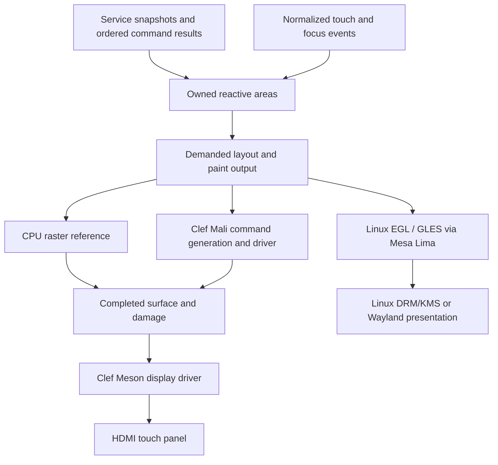

# Sweet Potato: a native accelerated KeyStation panel

Design dated 2026-09-18. The Libre Computer AML-S905X-CC-V2 is the proposed
KeyStation host. The target is a Clef unikernel with a local touch UI and a
restricted native GPU renderer. Linux provides a useful reference implementation
and a separately supported deployment route. This repository has no accepted
Sweet Potato display or GPU implementation yet.

KeyStation's key-authority service, Renesas HUK integration and encrypted-storage
acceleration have separate requirements. The UI experiment can run against a
synthetic service and establish graphics, input and scheduling behavior before
those systems are connected.

## Hardware responsibilities

Sweet Potato is an Amlogic S905X Cortex-A53 SBC used as an appliance. Its memory
system, boot firmware and graphics hardware require a different platform package
from an STM32-class MCU. The
[board entry](../../Fidelity.Platform/Hardware/Products/LibreComputer/AML_S905X_CC_V2/README.md)
owns identity and wiring. The
[platform port plan](../../Fidelity.Platform/docs/SWEET_POTATO_UI_PORT.md)
owns boot, device initialization, memory visibility and hardware acceptance.

| Facility | Role in the UI plan | Research basis |
| --- | --- | --- |
| Cortex-A53 CPU | Reactive work, layout, input, text preparation and reference rasterization | [U-Boot board documentation](https://docs.u-boot.org/en/latest/board/amlogic/libretech-cc.html) |
| Mali-450 GPU | Candidate for triangles, textured quads, glyph masks and alpha composition | [Mesa Lima](https://docs.mesa3d.org/drivers/lima.html) |
| Meson display pipeline | Fetch a completed surface, compose admitted planes, generate HDMI output | [Meson DRM documentation](https://docs.kernel.org/gpu/meson.html) |
| Video decoder, marketed as AVE10 | Compressed video playback, outside the first UI port | [Manufacturer product page](https://libre.computer/products/aml-s905x-cc-v2/) |
| GE2D blitter | Optional investigation after GXL applicability and required operations are established | [Inspected Linux driver](https://github.com/torvalds/linux/blob/v6.12/drivers/media/platform/amlogic/meson-ge2d/ge2d.c) |

Hardware video decoding does not accelerate control layout or fades. HDMI
describes the display connection. UI acceleration needs a working raster and
composition path into buffers that the display controller can consume.

Mali-450 belongs to the Utgard family supported by Lima. Mesa's relevant graphics
target is OpenGL ES 2.0. Vulkan, OpenCL and the Panfrost driver are unsuitable
assumptions for this part. The native port should start with a small set of UI
drawing operations. Recreating the OpenGL implementation would add work
that the initial panel does not need. See [Lima's API and driver boundaries](https://docs.mesa3d.org/drivers/lima.html).

## One component model through three render paths

The same admitted controls, actions, identity and reactive-area semantics should
drive a CPU renderer, a hosted Linux renderer and the native Mali renderer.
Application layout should not mention GPU jobs, display registers or USB reports.
Quiet functional composition remains the default. A CE can elaborate to the
same descriptions without selecting a thread or changing device ownership.

Linux is useful for inspecting the board, EDID, input reports and reference
rendering. A Linux executable would bind supported userspace APIs through
Farscape. A unikernel must supply allocation, cache maintenance, interrupts,
device clocks, submission and display ownership itself. Binding a Linux kernel
driver's C entry points does not provide those services.

The first native renderer should admit solid and textured triangles, scissoring,
premultiplied-alpha composition and a bounded glyph/image atlas. Keep layout,
text shaping and initial tessellation on the CPU. Begin with a small, pinned set
of shaders prepared offline and known render states. A later Clef shader
producer can replace that build dependency. The port still needs both the
[device/job machinery](https://github.com/torvalds/linux/tree/v6.12/drivers/gpu/drm/lima)
and the [drawing/command-generation machinery](https://gitlab.freedesktop.org/mesa/mesa/-/tree/mesa-24.3.0/src/gallium/drivers/lima).

The CPU renderer remains a reference for clipping, rotation, alpha and damage.
An unsupported operation needs an explicit software realization or a rejected
capability requirement. Silent omission would break the shared component
contract. Resource exhaustion also needs a product policy, such as dropping a
decorative transition while applying its final state.

Define color and alpha conventions at the drawing boundary. In particular,
fading a group with overlapping children differs from multiplying each child's
opacity. The renderer may need an intermediate surface for the group. Compare
edge coverage, glyph masks and overlapping translucent content against the CPU
reference before admitting that optimization.

## Cold work and active presentation

A mounted KeyStation overview might contain connection state, a selected-item
editor, activity history and a transient notification. Each area can observe
the state it needs. An incoming status value should not rerun unrelated text
layout or upload an unchanged icon atlas.

Construction stays cold. Mounting establishes owned demand. Closing the activity
view releases its visual demand while a separately owned service may keep a
bounded history or projection current. That background observation does not
require a GPU job. Preparing an inactive view's geometry or pixels is a separate
choice with its own memory and execution budget.

A fade creates temporary clock demand in the presentation owner. Each sample
uses monotonic elapsed time. Completion, cancellation and view retirement remove
that demand. Retargeting begins from the presented value. An opacity change may
reuse an already rendered group, provided group blending and clipping remain
correct. It can still damage a large part of the screen. The profile must bound
cached layers, uploads and pending frames.

Retained pixels are also useful without motion. At idle, the display controller
continues scanning the current surface while the UI does no new layout, raster
or GPU submission. A lower UI update rate does not by itself lower the HDMI
refresh rate or eliminate scanout memory traffic.

For the first implementation, use one UI/presentation owner. Worker jobs can
produce versioned immutable geometry or disjoint raster work later. A stale
result can be discarded before publication. Work already submitted to a device
retains its resources until the device has stopped accessing them.

## Buffers and completion

The proposed backend boundary carries a render target description, admitted
paint operations, damage, scene/surface revisions and resource leases. Submission
returns a completion object. Presentation returns a distinct release condition.
These are design requirements, not new public API names.

| Event | What it permits |
| --- | --- |
| Area invalidation | Demand a newer visual result |
| Owner retirement | Stop admitting work and detach observations |
| CPU preparation completion | Submit prepared resources after required visibility operations |
| GPU render completion | Read or present rendered pixels after the required synchronization |
| Display release | Reuse a surface once no other producer or consumer still owns access |

The GPU and display share physical DRAM with the CPU. Their address mappings,
cache state and accessible formats remain separate obligations. A GPU texture
cannot be assumed to be a linear scanout buffer. The inspected GXL primary-plane
path admits linear buffers. Start with an accepted linear target or an explicit
resolve/copy, including that operation in the budget. See
[Meson primary-plane formats and modifiers](https://github.com/torvalds/linux/blob/v6.12/drivers/gpu/drm/meson/meson_plane.c).

Partial redraw also needs per-buffer content validity. When a back buffer holds
an older scene, repainting only the newest damage can leave stale pixels from
earlier frames. Track each buffer's scene revision and accumulated damage, copy
from a compatible completed surface, or perform a full redraw. GPU tile rendering
and attachment load/store behavior must preserve pixels outside the updated
region before selective raster work can be counted as a saving.

Fidelity.Platform's
[handoff contracts](../../Fidelity.Platform/docs/ADMISSION_AND_SIDECARS.md)
already distinguish mapping evidence, producer completion and consumer release.
Their reference checks do not implement a Mali allocator or establish hardware
coherence. A native driver must produce and consume the corresponding evidence.

On a GPU fault, stop new submissions and establish that outstanding device
access has ceased before reclaiming memory. CPU rendering is a possible recovery
path only after that ownership problem is resolved. Logical cancellation alone
cannot make a buffer reusable.

## The rack-mounted display

The provisional panel is the
[Waveshare 7.9inch HDMI LCD](https://www.waveshare.com/wiki/7.9inch_HDMI_LCD),
with 400 × 1280 physical pixels and USB capacitive touch. The exact SKU remains
unconfirmed. A horizontal installation would present a 1280 × 400 logical
UI while retaining a compatible physical scanout mode.

The inspected
[`meson_venc_hdmi_supported_mode`](https://github.com/torvalds/linux/blob/v6.12/drivers/gpu/drm/meson/meson_venc.c)
accepts dimensions starting at 400 pixels horizontally and 480 vertically for
its non-CEA path. A 1280 × 400 wire mode fails that height check. A 400 × 1280
mode passes the dimension checks, but its actual timing still needs clock and
panel qualification. The proposed renderer rotates the logical scene into that
portrait surface. Plane rotation is not assumed.

Touch coordinates need the inverse of the chosen presentation transform plus
any panel calibration. Test all corners, edge drags, clipping and focus with the
same transform used by hit testing. Confirm EDID, refresh timing, touch report
format, power and cable routing on the actual unit. Waveshare's Raspberry Pi
configuration examples are not Amlogic initialization instructions.

For a tightly packed 512,000-pixel surface, the following are arithmetic lower
bounds before pitch alignment, atlases, driver allocations and retained layers:

| Storage or traffic | Amount |
| --- | --- |
| One RGB565 surface | 1,024,000 bytes, about 0.977 MiB |
| One 32-bit surface | 2,048,000 bytes, about 1.953 MiB |
| Two 32-bit surfaces | 4,096,000 bytes, about 3.906 MiB |
| Three 32-bit surfaces | 6,144,000 bytes, about 5.859 MiB |
| 32-bit scanout at 60 Hz | 122.88 MB/s |
| Full 32-bit CPU write plus scanout at 60 Hz | 245.76 MB/s |
| The same with a separate full-surface rotation copy | 491.52 MB/s |

The final row counts render writes, rotation reads and writes, and scanout reads.
Blending, texture reads, overdraw and cache behavior add costs. Rendering directly
in the accepted orientation can avoid a separate rotation copy. None of these
numbers is a measurement of the board's sustainable bandwidth.

## Relationship to desktop GPUs and YoshiPi

Linux-hosted AMD, NVIDIA and Mali backends need the same kinds of UI contracts:
capability selection, target allocation, resource import, submission completion,
frame pacing and display release. Their native APIs, driver stacks and shader
formats differ. A reusable UI drawing interface should stop above those details.
CUDA or HIP compute bindings do not constitute a widget renderer.

For Sweet Potato, the native work extends below that shared interface into
Mali and Meson drivers. It should not require changing the application's
component syntax. This also preserves a route to CPU-only embedded profiles
and browser realization without claiming arbitrary shader or CSS portability.

The [YoshiPi carrier](https://github.com/yoshimoshi-garage/yoshipi) suggests another
useful profile: a Pi Zero 2 W with ADC, GPIO and touchscreen connections. Its
service/UI separation and component behavior can follow the same design.
Its Broadcom platform, display route and peripheral wiring require their own
source audit and drivers. Neither its touch wiring nor a Sweet Potato driver
should be inferred from the shared appliance use case.

## Implementation order

1. Record the actual board, firmware, RAM map, panel EDID and touch reports in
   the platform source pack. Establish a Linux reference image and scene captures.
2. Boot a minimal AArch64 Clef image with serial output and a documented memory
   handoff. Render a CPU test image into a firmware-provided framebuffer where
   available. Record that dependency explicitly.
3. Bring Meson HDMI initialization, buffer switching and USB touch under native
   ownership. Qualify the panel's portrait mode and the UI/input rotation.
4. Exercise reactive areas with CPU rendering: selective updates, text resize,
   overlapping alpha, disposal and repeated opening of an inactive view.
5. Submit a restricted Mali workload, establish completion and fault handling,
   then present its output through the already accepted display path.
6. Add glyph/image caching and selected transitions. Compare CPU and GPU output
   and measure active-frame cost, first activation, input latency and idle work.

The [platform acceptance ladder](../../Fidelity.Platform/docs/SWEET_POTATO_UI_PORT.md#acceptance-ladder)
defines the hardware evidence for each step. A first useful KeyStation panel
does not need codec playback, a full OpenGL port or GE2D support.
